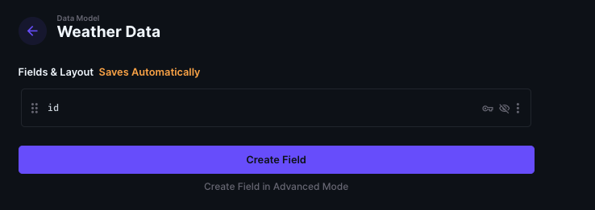
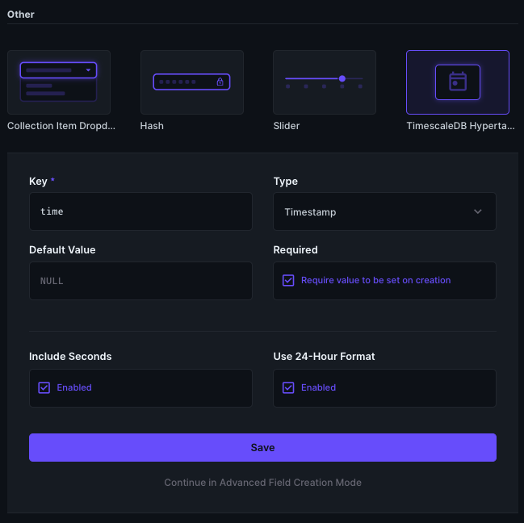
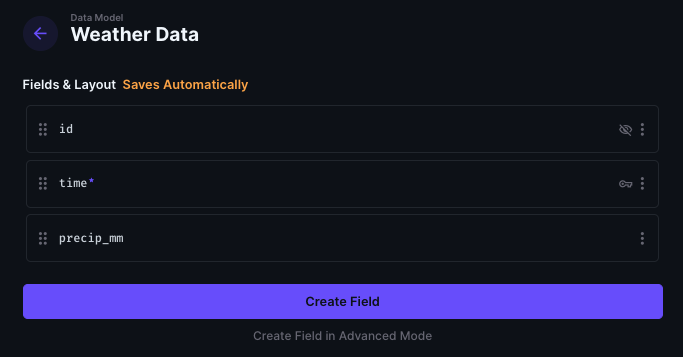

# Directus TimescaleDB (WIP)

Create TimescaleDB Hypertables from within Directus.

### Step 1: Create a collection as normal



### Step 2: Add the hypertable time field



### Step 3: Voila a new hypertable 
(notice the primary key switch from `id` to `time`)



### The issue:
* Directus requires a non-composite primary key
* TimescaleDB/Postgres requires that any unique constraints on a table must contain the time column (partitioning key)
* Therefore the only column that can be a primary key is the time column

Solutions:
 * Directus's Collection editor could allow configuring tables regardless of whether they have a primary key.

## Methodology:

### Hypertable Interface
This is just a copy of the builtin datetime column. It is used as a signal for the hook and a place to store future hypertable options.

### TimescaleDB Reconciler Hooks
Actions that run on schema updates.

Current Logic:
1. Check the field metadata to make sure that the updates only apply to collections with the hypertable field
2. Check the current status of the hypertable using `timescaledb_information.hypertables`
3. If the table needs to be transformed into a hypertable:
    1. Remove the primary key (Danger Danger)
        * Make the time field the primary key instead (not cool!)
    2. Make sure that directus knows the time field is not nullable (Can we hide the options altogether?)
    3. Remove any unique indexes not containing the time field (Oops but necessary)
    4. Convert table to a hypertable.


## Issues:

### Primary Keys

PostgresQL does not support primary keys [that do not contain your table partitioning key (e.g. time)](https://docs.timescale.com/use-timescale/latest/hypertables/hypertables-and-unique-indexes/).

So we try to see if we can just drop the unique constraint of the primary key before creating the table.

After converting to hypertable, we get [this error](https://github.com/directus/directus/blob/46611e67512279127216ddeec99a810cfb450dce/api/src/utils/get-schema.ts#L137).

Therefore we are forced into `PRIMARY KEY(time)` for the time being.

Ideally, we would not have to touch primary keys.

### Unique Indexes

Similar to above, you also cannot have unique indexes that do not contain the partitioning key so we have to drop those as well.

Not ideal, and I wonder if this could cause Directus to malfunction.

### Can we make nullable be non-configurable?

Sometimes when editing the field, it will give this error.

```
ERROR:  cannot drop not-null constraint from a time-partitioned column
```
I think it's possible that the directus configuration fell out of sync with the actual table schema due to an error, so this may just be a case of enforcing the non-nullable field in a better way.